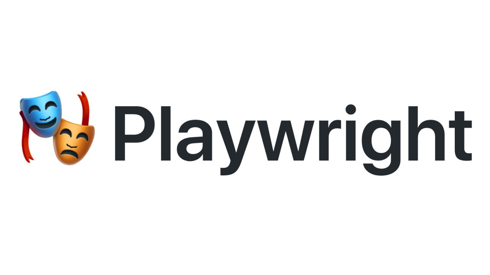

## Sobre
- Automação de testes em Playwright da funcionalidade cadastro Forms
- Workflow de testes contínuos em Playwright no Github Actions


## Stacks
- Playwright
- TypeScript
- TestResults

## Rodando

1. Clonar o repositório, instalar as dependências
```
npm install
```

2. Executar testes em Headless
```
npx playwright test 
```

3. Executar para ver o relatório dos testes
```
npx playwright show-report
```


